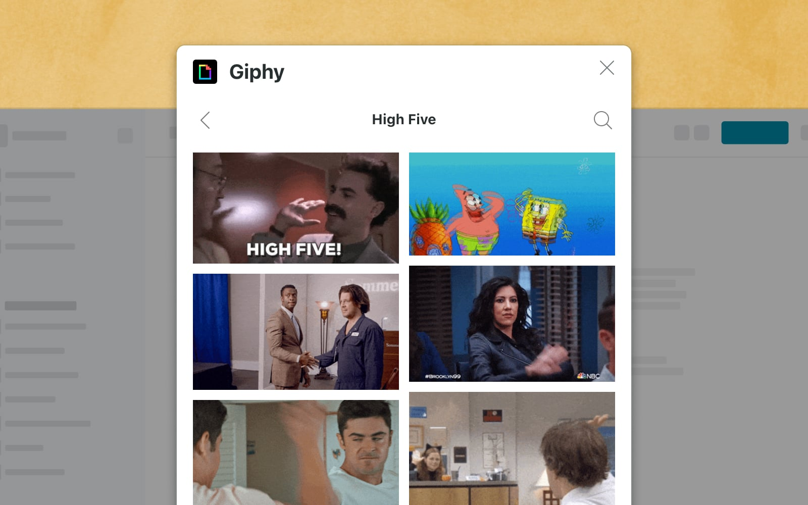
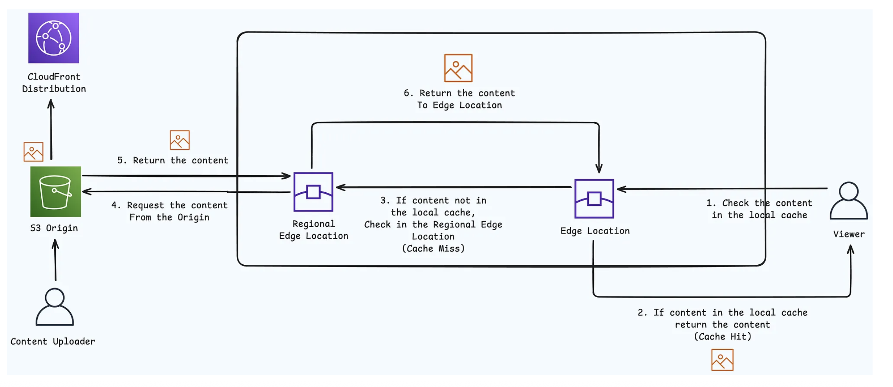
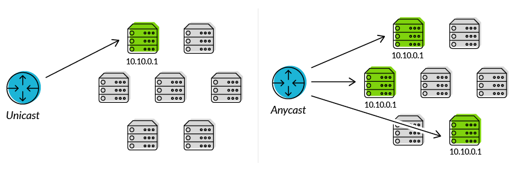

 
**Giphy**: host, server and search GIFs <br/>
**Back of Envelope** : 10 Billion content served every day.

Serving API is easy and efficient, But the real challenge is serving Images!!  
	- Because API responses are short.  
	- Because images/videos are large.  
Hence to save them efficiently we need CDN.

## What Giphy Caches on CDN ?
- Media Content - images, videos
- Search and discover API responses
	```
	/v1/gifs/trending
	/v1/search?q=funny
	```
### Why CDN ?
 - Geographical Nearness
 - Every single server of cdn is called as **edge server**.
 - Content is served from the edge servers near to the user.
 - CDN is nothing but cache, it helps reduce response time as it's edge server are near to the user.
 - CDN uses **anycast** network.
	 

	 - **Anycast**
		 - Ref: https://www.cloudflare.com/en-in/learning/cdn/glossary/anycast-network/
		 - Anycast is a network addressing and routing method in which incoming requests can be routed to a variety of different locations or “nodes.” In the context of a [CDN](https://www.cloudflare.com/learning/cdn/what-is-a-cdn/), Anycast typically routes incoming traffic to the nearest [data center](https://www.cloudflare.com/learning/cdn/glossary/data-center/) with the capacity to process the request efficiently. Selective routing allows an Anycast network to be resilient in the face of high traffic volume, network congestion, and [DDoS attacks](https://www.cloudflare.com/learning/ddos/what-is-a-ddos-attack/)
		
		- **How does Anycast work?**  
			Anycast network routing is able to route incoming connection requests across multiple data centers. When requests come into a single [IP address](https://www.cloudflare.com/learning/dns/glossary/what-is-my-ip-address/) associated with the Anycast network, the network distributes the data based on some prioritization methodology. 
			The selection process behind choosing a particular data center will typically be optimized to reduce [latency](https://www.cloudflare.com/learning/performance/glossary/what-is-latency/) by selecting the data center with the shortest distance from the requester. 
			Anycast is characterized by a **1-to-1 of many association**, and is one of the 5 main network protocol methods used in the Internet protocol.
			

- We can configure `max-age` and `s-maxage` that defines how long (in **seconds**) a response can be considered _fresh_ by **any cache** (browser, CDN, proxy).
- `Cache-Control: max-age=600`


### Drawbacks of Single Layer
- Each Edge Server has its own cache. When content goes viral
	- multiple edge gets request
	- cache miss
	- load on origin
- Solution (Multi-layer CDN)
	- A **shield server** (sometimes called **origin shield** or **shielding POP**) is a **designated caching layer inside the CDN** that sits between:
	- **Edge nodes** (closest to the user), and Your origin server (your API/backend).
		- Its purpose is to **reduce the number of direct requests to the origin** and centralize origin fetches.
		- Without shielding:
			- Each edge POP (point of presence) makes requests directly to your origin.
			- Example: if you have users in 50 regions → you could get **50 duplicate origin fetches** when cache expires.
 
  ### Other Approaches used by Giphy
  - **Route Specific TTL**
  - **Response Configured Caching**
	  - Response headers `max-age` and `s-maxage` can tell the CDN the duration of caching for specific Origin response.
  - **Cache Invalidation by grouping** (can be achieved through surrogate keys)  
	    - invalidate cached API responses that contains a specific GIF  
	    - invalidate cached API responses where query contains word 'w'

_______________________________________________________________
Ref:  
	- https://www.youtube.com/watch?v=-bo7oVejgRM  
	- https://www.cloudflare.com/en-in/learning/cdn/glossary/anycast-network/